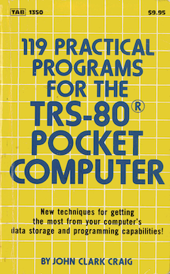

119 Practical Programs for the TRS-80 Pocket Computer
=====================================================

by John Clark Graig

[This brilliant vintage programming book](119-practical-programs-for-the-TRS-80.pdf) published in 1982 has a special place in our hearts and minds.  It introduced practical numerical programs for a tiny computer, the famous 1980 [Sharp PC-1211](https://en.wikipedia.org/wiki/Sharp_PC-1211) rebadged the TRS-80 Pocket Computer ("PC-1"), known as the first pocket computer in existance.  For modern standards it is not impressive.  However, in 1980, the same year the Sinclair ZX80 was introduced and two years before the Commodore 64 was launched, this Pocket Computer already had an enhanced version of Basic with line labelling, computed GOTOs, INPUT and DATA statements that accepts expressions instead of just constants, SHIFT+KEY to run a labelled program (DEF mode) with AREAD to read the last answer into the running program, and computations with high accuracy in 10+2 digit decimal floating point.

119 programs
------------

The 119 programs were tested and converted to wav files.  Five programs had minor bugs that were fixed.

The program title, the starting page number describing the program and input, the Basic source file, the Basic image size, and program labels are listed in the table below.  Data `A()` means that the program may use array values `A(27)` and above to store application data.  If insufficient memory is available to allocate `A(27)` and higher, then the program may terminate with a memory error.

| title | page | file | size | data | labels |
| ----- | ---- | ---- | ---- | ---- | ------ |
| All-Purpose Driver | 1 | [=.bas](=.bas) | 25 | | = |
| Bernoulli Numbers | 3 | [B.bas](B.bas) | 97 | | B |
| Bessel Functions | 5 | [BSLJ.bas](BSLJ.bas) | 362 | | BSLJ BSLI |
| Black Holes | 7 | [BH.bas](BH.bas) | 287 | | BH |
| Boolean Logic Truth Table | 9 | [BOOL.bas](BOOL.bas) | 181 | A() | BOOL |
| Calendar - Date | 13 | [DATE.bas](DATE.bas) | 148 | | DATE |
| Calendar - Easter | 15 | [EASTER.bas](EASTER.bas) | 297 | | EASTER |
| Calendar - Moon | 17 | [MOON.bas](MOON.bas) | 172 | | MOON |
| Calendar - Subroutines | 19 | [DJ.bas](DJ.bas) | 303 | | DJ JD |
| Calendar - Two Dates | 21 | [2DATES.bas](2DATES.bas) | 191 | | 2DATES |
| Checkbook | 23 | [CHECKS.bas](CHECKS.bas) | 243 | | CHECKS |
| Chi-Square | 25 | [CHI.bas](CHI.bas) | 75 | | CHI |
| Circle - Determined by Three X,Y Points | 27 | [CIR.bas](CIR.bas) | 240 | | CIR |
| Combinations | 29 | [CO.bas](CO.bas) | 71 | | CO |
| Complex Number Functions | 33 | [C.bas](C.bas) | 501 | | C+ C- C\* C/ 1/C RP PR C2 [SQR]C |
| Complex Numbers - Simultaneous Equations, Size Two | 35 | [CSE2.bas](CSE2.bas) | 215 | | CSE2 |
| Coordinate Systems for Three Dimensions | 37 | [CYL.bas](CYL.bas) | 338 | | CYL SPH REC |
| Coordinate Translation / Rotation | 41 | [CTR.bas](CTR.bas) | 127 | | CTR |
| Cubic Equations | 43 | [CUB.bas](CUB.bas) | 398 | | CUB |
| Curve Fit - Exponential | 45 | [CFE.bas](CFE.bas) | 199 | | CFE |
| Curve Fit - Geometric | 47 | [CFG.bas](CFG.bas) | 200 | | CFG |
| Curve Fit - Linear | 49 | [CFL.bas](CFL.bas) | 185 | | CFL |
| Curve Fit - Logarithmic | 51 | [CFLN.bas](CFLN.bas) | 197 | | CFLN |
| Curve Fit - Multiple Linear Regression | 53 | [MLR.bas](MLR.bas) | 267 | | MLR |
| Curve Fit - Parabolic | 55 | [CFP.bas](CFP.bas) | 333 | | CFP |
| Decimal to Fraction Conversion | 57 | [DF.bas](DF.bas) | 138 | | DF |
| Derivatives of a Function | 59 | [D.bas](D.bas) | 227 | | D0 D1 D2 FX |
| Determinant - Three by Three Matrix | 63 | [DT3.bas](DT3.bas) | 54 | | DT3 |
| Determinant - Two by Two Matrix | 61 | [DT2.bas](DT2.bas) | 26 | | DT2 |
| Dice Thrower | 65 | [DICE.bas](DICE.bas) | 62 | | DICE R |
| Differential Equations | 67 | [DE.bas](DE.bas) | 170 | | DE FX |
| Distribution - Binomial | 69 | [BIN.bas](BIN.bas) | 115 | | BIN |
| Distribution - Hypergeometric | 71 | [HYP.bas](HYP.bas) | 176 | | HYP |
| Distribution - Normal | 73 | [NORM.bas](NORM.bas) | 145 | | NORM |
| Distribution - Poisson | 75 | [POI.bas](POI.bas) | 62 | | POI |
| EXP(X) for Large X | 99 | [EX.bas](EX.bas) | 47 | | EX |
| Electronics - Balanced Bridge | 77 | [BRI.bas](BRI.bas) | 116 | | BRI |
| Electronics - Decibels | 79 | [DCBL.bas](DCBL.bas) | 163 | | DCBL |
| Electronics - Ohm's Law | 81 | [OHM.bas](OHM.bas) | 174 | | OHM |
| Electronics - RC Timing | 83 | [RC.bas](RC.bas) | 233 | | RC |
| Electronics - Resistor Analysis | 87 | [RR.bas](RR.bas) | 142 | | RR RRR |
| Electronics - Resonant Frequency | 91 | [FLC.bas](FLC.bas) | 129 | | FLC |
| Error Function - And Complement | 93 | [ERF.bas](ERF.bas) | 222 | | ERF |
| Euler Function | 95 | [EU.bas](EU.bas) | 103 | | EU |
| Euler Numbers | 97 | [EN.bas](EN.bas) | 73 | | EN |
| Factorial - Three Versions | 101 | [FA.bas](FA.bas) | 117 | | FA1 FA2 FA3 |
| Factors of a Positive Integer | 103 | [FS.bas](FS.bas) | 71 | | FS |
| Fibonacci Numbers | 105 | [FIB.bas](FIB.bas) | 57 | | FIB |
| Flash Cards - Multiplication Table | 107 | [MT.bas](MT.bas) | 229 | | MT |
| Fractions | 109 | [F.bas](F.bas) | 234 | | F+ F- F\* F/ FLT |
| Games - "Deal 'Em" | 113 | [DEAL.bas](DEAL.bas) | 357 | A() | DEAL |
| Games - "Huh?" | 115 | [HUH.bas](HUH.bas) | 265 | | HUH |
| Games - "Lunar Landing" | 117 | [LUNAR.bas](LUNAR.bas) | 393 | | LUNAR |
| Games - "Numb" | 119 | [NUMB.bas](NUMB.bas) | 203 | | NUMB |
| Games - "Pool" | 121 | [POOL.bas](POOL.bas) | 302 | | POOL |
| Games - "Wug Hunt" | 123 | [WUG.bas](WUG.bas) | 282 | | WUG |
| Gamma Function | 125 | [GA.bas](GA.bas) | 203 | | GA |
| Graphing Helper - Creating a "Nice" Axis | 127 | [GR.bas](GR.bas) | 243 | | GR |
| Graphing Helper - Plotting a Function | 131 | [FUN.bas](FUN.bas) | 118 | | FUN FX |
| Greatest Common Divisor | 133 | [GCD.bas](GCD.bas) | 56 | | GCD |
| Gudermannian Function and Inverse | 135 | [GD.bas](GD.bas) | 49 | | GD IGD |
| Histogram Bins | 137 | [HB.bas](HB.bas) | 182 | A() | HB |
| Hyperbolic Functions | 141 | [SINH.bas](SINH.bas) | 173 | | SINH COSH TANH ASNH ACSH ATNH |
| Integrals - Cosine Integral | 143 | [CI.bas](CI.bas) | 115 | | CI |
| Integrals - Exponential Integral | 145 | [EI.bas](EI.bas) | 81 | | EI |
| Integrals - Sine Integral | 147 | [SI.bas](SI.bas) | 107 | | SI |
| Integration - Gaussian Quadrature | 149 | [GQ.bas](GQ.bas) | 332 | | GQ FX FX |
| Integration - Simpson's Rule | 153 | [SIMP.bas](SIMP.bas) | 162 | | SIMP FX |
| Integration - Weddle's Rule | 155 | [WEDD.bas](WEDD.bas) | 162 | | WEDD FX |
| Interpolation - Lagrange | 159 | [LGI.bas](LGI.bas) | 187 | A() | LGI |
| Interpolation - Linear | 161 | [LI.bas](LI.bas) | 113 | | LI |
| Least Common Multiple | 163 | [LCM.bas](LCM.bas) | 74 | | LCM |
| Limit of a Function | 165 | [LIM.bas](LIM.bas) | 144 | | LIM FX |
| Line Analysis | 167 | [LN.bas](LN.bas) | 151 | | LN |
| Loan | 169 | [LOAN.bas](LOAN.bas) | 531 | | LOAN |
| Logarithms in any Base | 171 | [LB.bas](LB.bas) | 34 | | LB |
| Matrix Inversion | 173 | [MATI.bas](MATI.bas) | 537 | A() | MATI MATOUT |
| Mean And Standard Deviation - Grouped Data | 177 | [MSDG.bas](MSDG.bas) | 110 | | MSDG |
| Mean And Standard Deviation - Ungrouped Data | 179 | [MSD.bas](MSD.bas) | 97 | | MSD |
| Means - Arithmetic, Geometric, And Harmonic | 181 | [MNS.bas](MNS.bas) | 124 | | MNS |
| Metric Conversions | 183 | [CONV.bas](CONV.bas) | 67 | | G.L M.K |
| Miles Per Gallon | 185 | [MPG.bas](MPG.bas) | 156 | | MPG |
| Miles Per Hour | 187 | [MPH.bas](MPH.bas) | 108 | | MPH |
| Moving Average | 189 | [MAV.bas](MAV.bas) | 162 | A() | MAV |
| Number Conversions - Binary to Decimal | 191 | [BD.bas](BD.bas) | 87 | | BD |
| Number Conversions - Decimal to Binary | 193 | [DB.bas](DB.bas) | 82 | | DB |
| Number Conversions - Decimal to Hexadecimal | 195 | [DH.bas](DH.bas) | 88 | | DH |
| Number Conversions - Decimal to Octal | 197 | [DO.bas](DO.bas) | 84 | | DO |
| Number Conversions - Hexadecimal to Decimal | 199 | [HD.bas](HD.bas) | 93 | | HD |
| Number Conversions - Octal to Decimal | 201 | [OD.bas](OD.bas) | 87 | | OD |
| Permutations | 203 | [PERM.bas](PERM.bas) | 50 | | PERM |
| Pi - By Dartboard | 205 | [PI.bas](PI.bas) | 151 | | PI |
| Plotting - Three Dimensions | 209 | [3D.bas](3D.bas) | 115 | | 3D |
| Pocket Alarm Clock | 215 | [ACLK.bas](ACLK.bas) | 181 | | ACLK |
| Pocket Watch | 217 | [CLK.bas](CLK.bas) | 141 | | CLK |
| Pocketext | 213 | [WRI.bas](WRI.bas) | 195 | | WRI REA EDI |
| Polar to Rectangular | 219 | [PR.bas](PR.bas) | 45 | | PR |
| Polygon by Walkaround | 225 | [PW.bas](PW.bas) | 123 | | PW |
| Polygons - Regular | 227 | [POLY.bas](POLY.bas) | 373 | | POLY |
| Prime Numbers | 231 | [PRI.bas](PRI.bas) | 100 | | PRI |
| Quadratic Equations | 233 | [QE.bas](QE.bas) | 149 | | QE |
| Radioisotope Activity | 235 | [RAD.bas](RAD.bas) | 238 | | RAD |
| Random Numbers - Exponential Distribution | 237 | [RNDE.bas](RNDE.bas) | 49 | | RNDE |
| Random Numbers - Integers from I to J | 239 | [RNDI.bas](RNDI.bas) | 68 | | RNDI |
| Random Numbers - Normal Distribution | 241 | [RNDN.bas](RNDN.bas) | 118 | | RNDN |
| Random Numbers - Reals from A to B | 243 | [RNDR.bas](RNDR.bas) | 63 | | RNDR |
| Rectangular to Polar | 245 | [RP.bas](RP.bas) | 66 | | RP |
| Relativity | 247 | [REL.bas](REL.bas) | 203 | | REL |
| Simultaneous Equations - Flexible Size | 253 | [SIEQ.bas](SIEQ.bas) | 456 | A() | SIEQ |
| Simultaneous Equations - Size Three | 251 | [SE3.bas](SE3.bas) | 204 | | SE3 |
| Simultaneous Equations - Size Two | 249 | [SE2.bas](SE2.bas) | 56 | | SE2 |
| Spherical Triangles | 257 | [SSS.bas](SSS.bas) | 542 | | SSS AAA SAS ASA SSA AAS |
| Temperature Conversions | 261 | [CF.bas](CF.bas) | 46 | | CF |
| Triangle Analysis | 262 | [SSA.bas](SSA.bas) | 399 | | ASA SSS SAA SAS SSA |
| Triangles - In Space | 267 | [T3D.bas](T3D.bas) | 300 | | T3D |
| Vectors | 269 | [V.bas](V.bas) | 561 | | V+ V- VC VT VD VM VU VK STP |
| Volume - Defined by Four Cartesian Space Points | 281 | [VS.bas](VS.bas) | 195 | | VS |
| Wind Chill Index | 285 | [WCI.bas](WCI.bas) | 122 | | WCI |
| Zero of a Function | 287 | [ZF.bas](ZF.bas) | 166 | | ZF FX |

How to load the programs
------------------------

Enter `CLOAD"` on your TRS-80 or PC-1211 equipped with a cassette interface or a printer unit.  Play the =.wav file to load the "All-Purpose Driver" program first.

Enter `CLOAD1"` (with a `1`) on your TRS-80/PC-1211.  This command merges (actually appends) the next program to the existing ones.  Play the wav file of the Basic program you want to merge.

**Note:** If the last program loaded has a line 900 or 910 with an `"FX"` labelled function, then remove this line first before loading additional programs.  Loading additional programs makes it impossible to edit the previous programs.  Therefore, line `900 "FX"` becomes non-modifyable, which is not what we want.

All of the Basic programs use different labels and can be loaded together, except the two programs SSS.bas and SSA.bas that use the same set of labels.

How to create collections of programs
-------------------------------------

The combine.sh script takes a list of Basic programs with suffix .bas to combine them into one combined.bas by merging them.  The script removes lines 900 and 910 labelled `"FX"` to avoid saving non-modifyable `900 "FX"` labelled functions.  The combined.bas program should be converted with PocketTools to a wav file.  See the next section on PocketTools for details.

The total size of the Basic image should not exceed 1424 bytes.  The table lists the image size of each program.  Some programs may need `A()` data space as well, as indicated in the table.

All of the Basic programs use different labels and can in principle be combined, except the two programs SSS.bas and SSA.bas that use the same set of labels.

PocketTools
-----------

The Basic programs are converted to wav form using [PocketTools](https://www.peil-partner.de/ifhe.de/sharp/).  PocketTools runs on Windows.  On MacOS, Linux or Android, compile the PocketTools source code with a C compiler as follows:

    cd PocketTools_vvv/POCKTOOL/Sources
    make

This creates the `bas2img`, `bin2wav` and `wav2bin` utilities.  The conversion of a Basic file to a wav file takes two steps:

    bas2img --pc=1211 FILENAME.bas
    bin2wav FILENAME.img

The special characters **E** (decimal exponent), π (pi) and √ (square root) are specified as `[E]`, `[PI]` and `[SQR]` in the Basic source code.  These notations are converted by PocketTools to the corresponding character codes for the TRS-80/PC-1211.

Tips
----

- Pressing `SHIFT-=` when the computer is waiting on input brings you back to the top command line.  No need to press ON.
- Printing of the output works by switching the printer on and pressing ON twice

Fixed bugs in the programs
--------------------------

These bugs were found and fixed:

- GA.bas: fixed bug in line 40 typo in constant parameter
- LOAN.bas: fixed bug in line 80 missing ^ operator
- MPH.bas: fixed bug in line 10 missing minus sign in exponent
- POOL.bas: fixed bug in line 60 missing multiplication by S
- T3D.bas: fixed bug in line 70 assignment typo
